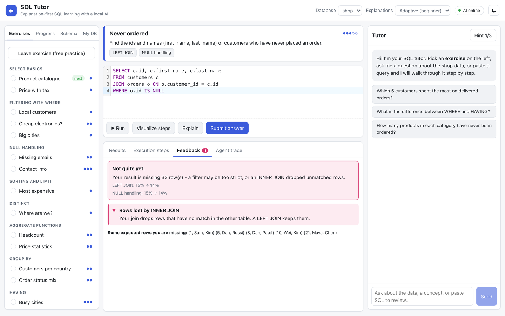

# SQL Tutor

A tutor for learning SQL. You write queries against a practice database, and when a query is wrong it tells you why and shows how the database ran it, step by step, instead of just handing you the answer.

It runs locally with free open-source models through [Ollama](https://ollama.com), so there are no API costs.

[](https://github.com/Shaga01/SQL-Conversational-Tutor/actions/workflows/ci.yml)



## What it does

- Checks your query and points out the actual mistake, for example a JOIN that drops rows or `= NULL` instead of `IS NULL`.
- Shows how the query is executed one clause at a time, with row counts.
- Gives hints before answers, and picks the next exercise based on what you've mastered.
- Answers questions about the data in plain English by writing and explaining the SQL.

Rule-based checks decide what's wrong with a query, and the language model explains it. Queries run in a read-only sandbox with time limits.

**Stack:** Python, FastAPI, React, TypeScript, SQLite, Ollama (Qwen2.5-Coder)

## Results

Evaluated on the Spider text-to-SQL benchmark (1,034 questions):

- The 7B model reaches 78% execution accuracy. The extra agent steps (example retrieval, self-correction) didn't improve that overall, only on the hardest questions.
- Fine-tuning a 1.5B model with QLoRA raised its accuracy from 57.0% to 60.5%.
- The mistake checker names the right error in 99% of about 20,000 test cases.

More detail: [project report](docs/REPORT.md) · [full results](eval/RESULTS.md)

## Running it

You need Python 3.11+, Node 20+ and [Ollama](https://ollama.com).

```bash
ollama pull qwen2.5-coder:7b && ollama pull nomic-embed-text

python3 -m venv .venv && source .venv/bin/activate
pip install -r backend/requirements.txt
uvicorn app.main:app --app-dir backend --port 8000

cd frontend && npm install && npm run dev    # open http://localhost:5173
```

Or with Docker: `docker compose up --build`, then open http://localhost:8080.

Tests: `cd backend && pip install pytest && python -m pytest`

## Background

This started as my capstone project at Boise State. This version is a rebuild with a proper sandbox, evaluation and the tutoring features.
