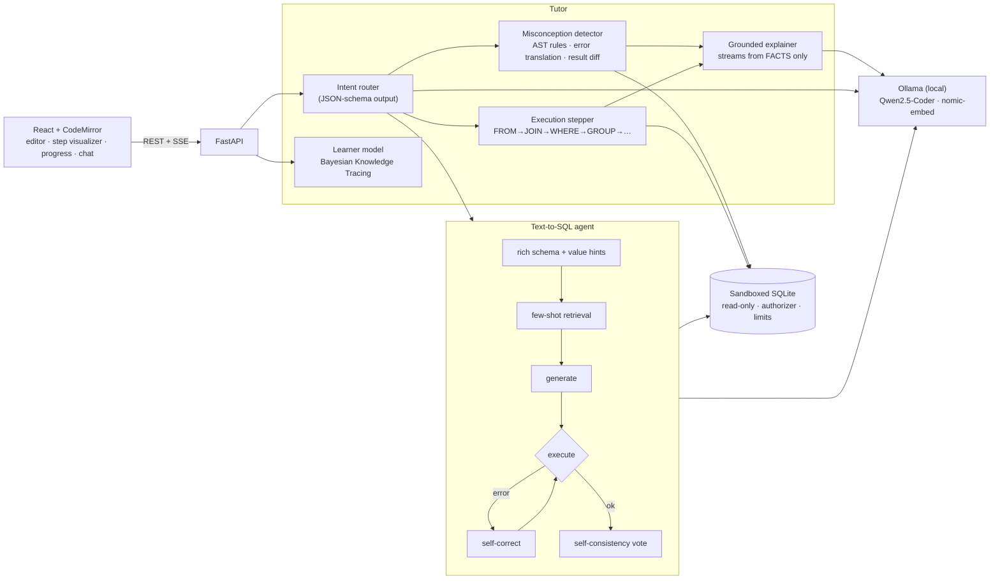

# SQL Tutor — explanation-first SQL learning with a local, measurable AI

An intelligent tutoring system for SQL. Learners write queries against a real database. When a query is wrong, the tutor finds *why* (wrong join type, `= NULL`, a LEFT JOIN undone by WHERE, …), shows how the database executes it step by step, and coaches with Socratic hints instead of handing over answers. It tracks per-skill mastery with Bayesian Knowledge Tracing and picks the next exercise to match.

Everything runs locally and costs nothing: open models served by [Ollama](https://ollama.com), SQLite, and a LoRA fine-tune trained on a laptop with Apple MLX.

[](../../actions/workflows/ci.yml)

## Highlights

- **Grounded feedback, not free-form guessing.** Deterministic analyzers decide *what* is wrong: 20+ misconception rules over the SQL syntax tree, SQLite error translation, database-aware checks, and result-set diffs against a reference. The LLM only decides *how to say it*, from a FACTS block it is told not to go beyond.
- **Feedback quality is measured, too.** Mutation testing injects known bugs into ~7,000 correct Spider queries; the tutor names the right mistake for ~99% of them and flags under 2% of the correct queries. Held-out and post-hoc numbers are reported separately.
- **An agentic text-to-SQL pipeline where each stage is measured.** Schema representation, value retrieval, few-shot RAG, execution-guided self-correction and self-consistency voting can each be toggled, and each is benchmarked on Spider with confidence intervals and significance tests.
- **Our own fine-tuned model.** A LoRA adapter for Qwen2.5-Coder-1.5B, trained on Spider's train split on an M3 MacBook, compared with its base model through an identical serving path.
- **Adaptive learning.** Bayesian Knowledge Tracing over a 16-skill prerequisite graph, with exercises chosen from the learner's zone of proximal development and explanation depth adapted to the inferred level.
- **A secure sandbox.** Four independent layers (AST validation, read-only connection, SQLite authorizer, time and memory limits), backed by adversarial tests (infinite recursive CTEs, Cartesian explosions, `ATTACH`, `zeroblob` memory bombs, …).

## Results

<!-- RESULTS:START -->
**Metric:** execution accuracy (EX) on the Spider dev set. A prediction counts as correct when running it returns the same result set as the gold query (row order only matters if the gold query has ORDER BY; column order is ignored), following the Spider test-suite convention.

**Sample:** a fixed random sample of 200 dev questions (seed 42), identical for every row below. Brackets show the 95% bootstrap confidence interval; *p* is an exact McNemar test against the previous row on the same questions. All models run locally via Ollama (Q4_K_M quantization) on an Apple M3 with 16 GB.

### Ablation: what each pipeline stage contributes (qwen2.5-coder:7b)

| Pipeline (cumulative) | EX % [95% CI] | Δ vs previous | *p* | easy | medium | hard | extra | LLM calls / question |
|---|---|---:|---:|---:|---:|---:|---:|---:|
| Baseline: one prompt, raw CREATE TABLE schema | **73.5** <sub>[67.5, 79.5]</sub> |  |  | 84.8 | 84.8 | 56.7 | 40.6 | 1.0 |
| + rich schema (descriptions, sample values) | **72.0** <sub>[66.0, 78.0]</sub> | -1.5 | 0.66 | 84.8 | 83.7 | 46.7 | 43.8 | 1.0 |
| + value hints (DB values matching the question) | **72.0** <sub>[65.5, 78.0]</sub> | +0.0 | 1.00 | 84.8 | 81.5 | 46.7 | 50.0 | 1.0 |
| + 3 retrieved few-shot examples (RAG over Spider train) | **74.5** <sub>[68.5, 80.0]</sub> | +2.5 | 0.44 | 80.4 | 85.9 | 53.3 | 53.1 | 1.0 |
| + execution-guided self-correction (≤2 rounds) | **76.5** <sub>[70.5, 82.0]</sub> | +2.0 | 0.12 | 80.4 | 89.1 | 53.3 | 56.2 | 1.1 |
| + self-consistency voting (5 samples) | **78.5** <sub>[72.5, 84.0]</sub> | +2.0 | 0.39 | 80.4 | 92.4 | 53.3 | 59.4 | 5.72 |
| + embedding-based schema linking | **78.5** <sub>[72.5, 84.0]</sub> | +0.0 | 1.00 | 80.4 | 91.3 | 56.7 | 59.4 | 5.7 |

Questions per difficulty bucket: easy 46, medium 92, hard 30, extra 32. Latency is not reported because the evaluation cache replays identical calls across rows.

Best configuration vs baseline: 73.5% → 78.5% (McNemar *p* = 0.087).


### Model comparison (same questions)

| Model | Baseline EX % | + rich schema, hints, few-shot, self-correction EX % |
|---|---|---|
| Qwen2.5-Coder 7B | **73.5** <sub>[67.5, 79.5]</sub> | **76.5** <sub>[70.5, 82.0]</sub> |
| Llama 3.1 8B | **71.0** <sub>[64.5, 77.0]</sub> | – |
| SQLCoder 7B † | **40.5** <sub>[33.5, 47.5]</sub> | – |

† SQLCoder is a completion model trained on its own prompt template, so it is evaluated with the template from its model card (single call, raw schema) rather than the chat pipeline.

### Tutor feedback quality: does the misconception detector name the right mistake?

Known-correct queries are mutated with one injected bug each (e.g. LEFT JOIN → JOIN, IS NULL → = NULL, dropped ON clause); *recall* is the share of mutants for which the tutor reports the matching misconception. *Grading* mode includes the result diff against the reference (exercise submissions); *static* mode is free practice with no reference. Mutants that return the correct result anyway are excluded. The last column is the share of the **unmutated, correct** queries that get any correctness warning.

| Query set | mutants | recall (grading) | recall (static) | correct queries flagged |
|---|---:|---:|---:|---:|
| Development: Spider dev + exercises (used while building the detector) | 3,000 | 98.9% | 97.3% | 1.6% of 1,062 |
| Held-out: Spider train, 140 DBs — first detector version | 18,408 | 99.3% | 97.8% | 2.1% of 6,997 |
| Held-out: Spider train_others, 6 DBs — before any fix | 3,188 | 100.0% | 100.0% | 8.6% of 1,659 |
| Post-hoc: Spider train, final detector ‡ | 19,613 | 99.1% | 97.7% | 1.6% of 6,997 |
| Post-hoc: Spider train_others, final detector ‡ | 3,178 | 100.0% | 100.0% | 0.4% of 1,659 |

‡ After fixing false-positive patterns found by inspecting flagged held-out queries (functional-dependency closure for GROUP BY, join-graph connectivity, dangling foreign keys, key-like join columns), so these rows are not held-out. A manual sample of the remaining flags on correct Spider queries showed mostly genuine problems in the reference SQL: Cartesian joins, wrong join keys, case-mismatched literals that return no rows, and non-deterministic GROUP BY columns.

Per injected bug (Spider train, 19,613 mutants):

| Injected bug | mutants | recall (grading) | recall (static) |
|---|---:|---:|---:|
| misspell column | 6,648 | 98.5% | 98.5% |
| misspell table | 6,588 | 99.3% | 99.3% |
| drop ON condition | 2,407 | 99.9% | 99.9% |
| join on unrelated ids | 1,191 | 97.9% | 97.9% |
| drop ORDER BY before LIMIT | 801 | 100.0% | 100.0% |
| change literal case | 696 | 100.0% | 100.0% |
| drop GROUP BY column | 618 | 100.0% | 100.0% |
| HAVING → WHERE | 390 | 100.0% | 100.0% |
| drop DISTINCT | 274 | 99.3% | 0.0% |

Static recall is 0% for dropped DISTINCT and LEFT → INNER by design: without a reference solution those queries are valid SQL, and only the result diff reveals the mistake.
<!-- RESULTS:END -->

Full tables, per-difficulty breakdowns and methodology: [eval/RESULTS.md](eval/RESULTS.md). Per-question predictions for every run are committed in [eval/results/](eval/results/).

## Architecture



| Path | What it does |
|---|---|
| [backend/app/sandbox.py](backend/app/sandbox.py) | Four-layer secure execution |
| [backend/app/text2sql/](backend/app/text2sql/) | Agent pipeline, schema linking, value hints, example retrieval |
| [backend/app/tutor/misconceptions.py](backend/app/tutor/misconceptions.py) | Mistake detection with evidence |
| [backend/app/tutor/stepper.py](backend/app/tutor/stepper.py) | Clause-by-clause execution with row counts |
| [backend/app/tutor/learner.py](backend/app/tutor/learner.py) | BKT mastery and adaptive exercise selection |
| [backend/app/tutor/conversation.py](backend/app/tutor/conversation.py) | Intent routing, grounded prompts, answer-leak guard, offline fallback |
| [backend/app/datasets/shop.py](backend/app/datasets/shop.py) | Deterministic teaching database designed to expose misconceptions |
| [eval/](eval/) | Spider harness, hardness port, ablation and report scripts |
| [eval/finetune/](eval/finetune/) | Data builder, MLX LoRA config, train → fuse → import → evaluate |

## Design decisions

- **Why deterministic analysis plus an LLM, and not the LLM alone?** A tutor that invents mistakes is worse than none. Rules are exact and testable; the test suite includes correct queries that must produce *zero* findings. The LLM adds tone, adapts to the learner's level, and handles open questions.
- **Why a synthetic dataset for teaching?** On a 4-row table most wrong queries return the right answer by accident. The shop database is generated so that customers without orders, NULL emails, cancelled orders and duplicate names make each classic mistake change the result.
- **Why grade by result equivalence?** Many different queries are correct. Grading runs both queries and compares result sets (multiset semantics, column order ignored, row order only when the reference sorts), the same rule used by the benchmark.
- **Why report failures honestly?** In the ablation, the rich schema representation did *not* help on Spider, whose schemas are small and self-descriptive. The table keeps that row.
- **Why mutation testing for the tutor?** Hand-written test cases only show that rules work on examples I thought of. Injecting bugs into thousands of real queries on databases I never looked at exposed four real detector flaws (for example, it suggested HAVING when the actual problem was a missing GROUP BY), and it also found errors in Spider's own reference SQL.
- **Infrastructure failures are never scored.** If the model server errors, the harness retries and otherwise leaves the question unscored for a resumed run, so an outage cannot pass as a wrong answer.

## Run it

Prerequisites: Python 3.11+, Node 20+, [Ollama](https://ollama.com).

```bash
ollama pull qwen2.5-coder:7b && ollama pull nomic-embed-text

python3 -m venv .venv && source .venv/bin/activate
pip install -r backend/requirements.txt pytest
uvicorn app.main:app --app-dir backend --port 8000        # API on :8000

cd frontend && npm install && npm run dev                 # UI on :5173 (proxies /api)
```

Without Ollama the app still works. The analyzer, stepper, grading and learner model are deterministic, and the tutor falls back to template feedback.

Docker: `docker compose up --build` (Ollama stays on the host so it can use the GPU), then open http://localhost:8080.

Tests: `cd backend && python -m pytest` (the LLM is faked, so the tests are fast and offline).

## Reproduce the evaluation

```bash
# Spider (official release, ~200 MB) -> eval/data/spider_data/
eval/run_ablation.sh 200          # ablation ladder + model comparison on a fixed 200-question sample
eval/run_full_dev.sh              # baseline vs app pipeline on all 1,034 dev questions
eval/finetune/run_finetune.sh     # LoRA fine-tune with MLX, import to Ollama, evaluate
python eval/make_report.py        # regenerate eval/RESULTS.md and this README's results section
```

Runs are resumable and LLM responses are cached, so re-running a report is instant.

## Project history

v1 was a course capstone (Boise State CS-695); its proposal, poster and report are in [docs/capstone/](docs/capstone/). The v1 report predates the evaluation harness, and its evaluation figures are superseded by the measured results above.
