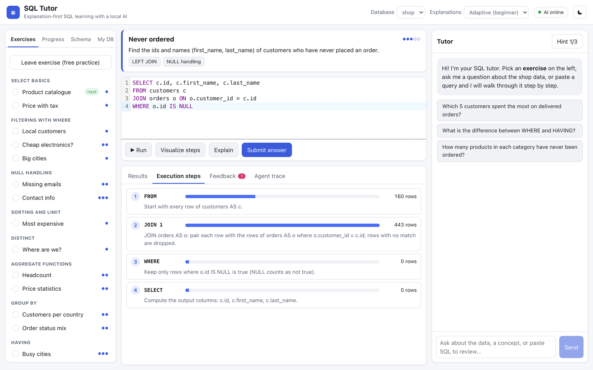
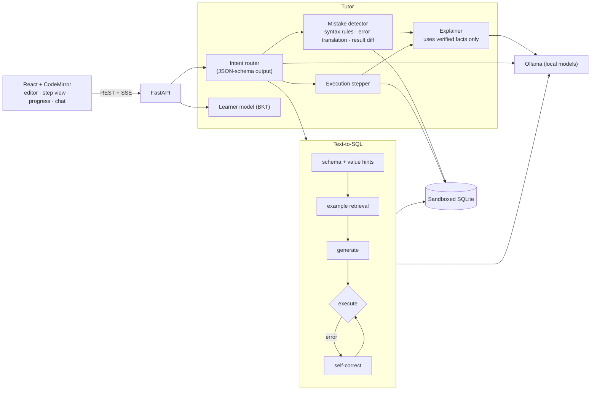

# SQL Tutor — project report

This is the detailed write-up. The short version is in the [README](../README.md), and all benchmark numbers (with confidence intervals and significance tests) are in [eval/RESULTS.md](../eval/RESULTS.md).

## Example

A learner uses an INNER JOIN to find customers who never ordered. The tutor names the mistake from the result diff, and the execution view shows why: the JOIN removes every customer without an order, so `o.id IS NULL` can never match (160 → 443 → 0 rows).

| Feedback | Step-by-step execution |
|---|---|
|  |  |

## Main pieces

- **Mistake detection.** Rules over the SQL syntax tree, translated SQLite errors, database-aware checks (e.g. `'boise'` vs `'Boise'`), and a result-set diff against the reference answer. The LLM only phrases the explanation, from facts produced by these checks.
- **Execution view.** Rebuilds the query clause by clause in execution order (FROM → JOIN → WHERE → GROUP BY → HAVING → SELECT → ORDER BY → LIMIT) and shows the row count after each step.
- **Learner model.** Bayesian Knowledge Tracing over 16 SQL skills with prerequisites; the next exercise targets the weakest unlocked skill. 28 auto-graded exercises with a three-step hint ladder.
- **Text-to-SQL.** For plain-English questions: schema and value hints, retrieval of similar solved examples, generation, execution, and self-correction from real database errors. Each step can be switched on or off for evaluation.
- **Sandbox.** Four independent layers: syntax-tree validation (single read-only statement), read-only connection, SQLite authorizer callback, and time/size limits. Covered by attack tests (infinite recursion, Cartesian explosions, `ATTACH`, memory bombs).
- **Fine-tuning.** QLoRA on Qwen2.5-Coder 1.5B with Apple MLX, on a laptop (3.3 GB peak memory).

## Architecture



| Path | What it does |
|---|---|
| [backend/app/sandbox.py](../backend/app/sandbox.py) | Secure query execution |
| [backend/app/text2sql/](../backend/app/text2sql/) | Text-to-SQL pipeline, schema linking, value hints, example retrieval |
| [backend/app/tutor/misconceptions.py](../backend/app/tutor/misconceptions.py) | Mistake detection |
| [backend/app/tutor/stepper.py](../backend/app/tutor/stepper.py) | Clause-by-clause execution |
| [backend/app/tutor/learner.py](../backend/app/tutor/learner.py) | Mastery tracking and exercise selection |
| [backend/app/tutor/conversation.py](../backend/app/tutor/conversation.py) | Intent routing, prompts, answer-leak guard, offline fallback |
| [backend/app/datasets/shop.py](../backend/app/datasets/shop.py) | Generated practice database |
| [eval/](../eval/) | Benchmark harness and report scripts |
| [eval/finetune/](../eval/finetune/) | Fine-tuning data, config and scripts |

## Design decisions

- **Rules decide, the LLM explains.** A tutor that invents mistakes does more harm than good. Rules are exact and testable, and the tests include correct queries that must produce no findings. The LLM handles tone, adapts to the learner's level, and answers open questions. If the model is down, the tutor still gives rule-based feedback.
- **A generated practice database.** On a 4-row table most wrong queries return the right answer by accident. The shop database includes customers without orders, NULL emails, cancelled orders and repeated names, so each classic mistake changes the result.
- **Grading by result.** Many different queries are correct, so grading runs both queries and compares the results (duplicates count, column order ignored, row order only when the reference sorts). The benchmark uses the same comparison.
- **Checking the checker.** Known bugs were injected into about 20,000 correct Spider queries to measure whether the tutor names the right mistake. This found real problems in the detector (for example, suggesting HAVING when the actual problem was a missing GROUP BY) and a few errors in Spider's own reference SQL.
- **Reporting results that didn't pan out.** The richer schema prompt didn't help on Spider, the pipeline's gain on a 200-question sample disappeared on the full 1,034 questions, and the first fine-tuning run made the model worse (a learning rate about 10× too high for MLX's LoRA scaling). All of these stay in the results.
- **Failures of the model server aren't scored.** The benchmark retries server errors and otherwise leaves the question for a later run, so an outage can't count as a wrong answer.

## Reproducing the evaluation

```bash
# Spider (official release, ~200 MB) -> eval/data/spider_data/
eval/run_ablation.sh 200          # pipeline ablation + model comparison, 200-question sample
eval/run_full_dev.sh              # baseline vs pipeline on all 1,034 dev questions
eval/finetune/run_finetune.sh     # QLoRA fine-tune with MLX, import to Ollama, evaluate
python eval/misconception_eval.py train   # mutation test of the mistake detector
python eval/make_report.py        # regenerate eval/RESULTS.md
```

Runs are resumable and model responses are cached. Per-question predictions for every run are in [eval/results/](../eval/results/).

## History

v1 was a course capstone at Boise State (CS-695); its proposal and poster are in [capstone/](capstone/). This version is a rebuild of it.
