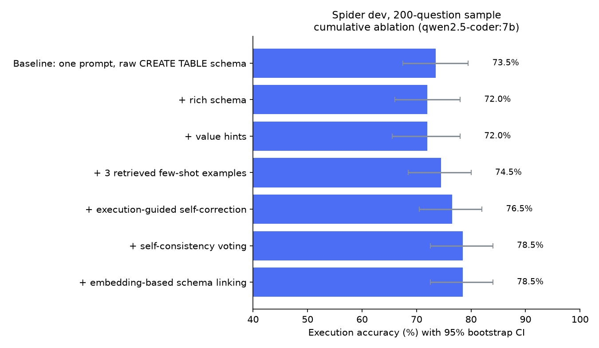

# Evaluation results

**Metric:** execution accuracy (EX) on the Spider dev set. A prediction counts as correct when running it returns the same result set as the gold query (row order only matters if the gold query has ORDER BY; column order is ignored), following the Spider test-suite convention.

**Samples:** headline rows use all 1,034 dev questions; ablation, model-comparison and fine-tuning tables use a fixed random sample of 200 dev questions (seed 42), identical for every row. Brackets show the 95% bootstrap confidence interval; *p* is an exact McNemar test on the same questions (in the ablation, against the previous row). All models run locally via Ollama (Q4_K_M quantization) on an Apple M3 with 16 GB.

## Key findings

- **Full dev set (1,034 questions):** a single-prompt baseline scores 78.4%; the app pipeline (rich schema, value hints, few-shot retrieval, self-correction) scores 77.8% (McNemar *p* = 0.66, no overall difference). It gains on extra-hard questions (47.1 → 54.1%) and loses on hard ones (74.1 → 68.7%). Gains seen for this configuration on the 200-question sample did not hold up on the full set.
- **Self-consistency voting** (5 samples) reached 78.5% vs 73.5% on the 200-question sample (*p* = 0.087) at ~5.7× the LLM calls; it was not run on the full set.
- **Our QLoRA fine-tune of Qwen2.5-Coder 1.5B** (trained on a laptop) improves it from 57.0% to 60.5% on the full dev set (McNemar *p* = 0.0033), at every difficulty level, with 58 fewer failing queries. The first attempt made the model worse; see below.
- **Tutor feedback:** on 19,613 injected bugs the misconception detector names the right mistake 99.1% of the time, and flags 1.6% of 6,997 correct queries.

## Headline: full Spider dev set (1,034 questions)

| Pipeline | EX % [95% CI] | easy | medium | hard | extra |
|---|---|---:|---:|---:|---:|
| Baseline (single prompt) | **78.4** <sub>[75.9, 80.9]</sub> | 90.6 | 84.5 | 74.1 | 47.1 |
| App pipeline (schema, hints, few-shot, self-correction) | **77.8** <sub>[75.3, 80.3]</sub> | 89.8 | 83.4 | 68.7 | 54.1 |

Paired McNemar test: *p* = 0.6587.

## Ablation: what each pipeline stage contributes (qwen2.5-coder:7b)

| Pipeline (cumulative) | EX % [95% CI] | Δ vs previous | *p* | easy | medium | hard | extra | LLM calls / question |
|---|---|---:|---:|---:|---:|---:|---:|---:|
| Baseline: one prompt, raw CREATE TABLE schema | **73.5** <sub>[67.5, 79.5]</sub> |  |  | 84.8 | 84.8 | 56.7 | 40.6 | 1.0 |
| + rich schema (descriptions, sample values) | **72.0** <sub>[66.0, 78.0]</sub> | -1.5 | 0.66 | 84.8 | 83.7 | 46.7 | 43.8 | 1.0 |
| + value hints (DB values matching the question) | **72.0** <sub>[65.5, 78.0]</sub> | +0.0 | 1.00 | 84.8 | 81.5 | 46.7 | 50.0 | 1.0 |
| + 3 retrieved few-shot examples (RAG over Spider train) | **74.5** <sub>[68.5, 80.0]</sub> | +2.5 | 0.44 | 80.4 | 85.9 | 53.3 | 53.1 | 1.0 |
| + execution-guided self-correction (≤2 rounds) | **76.5** <sub>[70.5, 82.0]</sub> | +2.0 | 0.12 | 80.4 | 89.1 | 53.3 | 56.2 | 1.1 |
| + self-consistency voting (5 samples) | **78.5** <sub>[72.5, 84.0]</sub> | +2.0 | 0.39 | 80.4 | 92.4 | 53.3 | 59.4 | 5.72 |
| + embedding-based schema linking | **78.5** <sub>[72.5, 84.0]</sub> | +0.0 | 1.00 | 80.4 | 91.3 | 56.7 | 59.4 | 5.7 |

Questions per difficulty bucket: easy 46, medium 92, hard 30, extra 32. Latency is not reported because the evaluation cache replays identical calls across rows.

Best configuration vs baseline: 73.5% → 78.5% (McNemar *p* = 0.087).



## Model comparison (same questions)

| Model | Baseline EX % | + rich schema, hints, few-shot, self-correction EX % |
|---|---|---|
| Qwen2.5-Coder 7B | **73.5** <sub>[67.5, 79.5]</sub> | **76.5** <sub>[70.5, 82.0]</sub> |
| Llama 3.1 8B | **71.0** <sub>[64.5, 77.0]</sub> | **73.0** <sub>[66.5, 79.0]</sub> |
| SQLCoder 7B † | **40.5** <sub>[33.5, 47.5]</sub> | – |

† SQLCoder is a completion model trained on its own prompt template, so it is evaluated with the template from its model card (single call, raw schema) rather than the chat pipeline.

## Fine-tuning a small model (QLoRA, trained locally with MLX)

| Model | Same prompt as training | + few-shot & self-correction |
|---|---|---|
| Qwen2.5-Coder 1.5B, base (same 4-bit round trip) | **54.5** <sub>[47.5, 61.5]</sub> | **50.0** <sub>[43.0, 57.0]</sub> |
| + LoRA run 1 (lr 1e-4, final step) ✗ | **42.5** <sub>[35.5, 49.5]</sub> | **29.5** <sub>[23.5, 35.5]</sub> |
| + LoRA run 2 (lr 1e-5, step chosen on validation DBs) | **59.0** <sub>[52.0, 65.5]</sub> | **53.5** <sub>[46.5, 60.5]</sub> |
| Qwen2.5-Coder 7B (reference) | **72.0** <sub>[65.5, 78.0]</sub> | **76.5** <sub>[70.5, 82.0]</sub> |

LoRA run 1 vs base (same prompt): -12.0 points, McNemar *p* = 0.002.

LoRA run 2 vs base (same prompt): +4.5 points, McNemar *p* = 0.150.

**Full dev set (1,034 questions), same prompt as training:** base **57.0** <sub>[54.0, 60.0]</sub> → LoRA run 2 **60.5** <sub>[57.5, 63.6]</sub>, +3.6 points, McNemar *p* = 0.0033.

Execution accuracy at each saved checkpoint (evaluated directly in MLX, before merging):

*adapters*, 60 questions from Spider dev sample (diagnosis only):

| step | 0 | 400 | 800 | 1200 | 1600 |
|---|---|---|---|---|---|
| EX % | 60 | 38 | 25 | 48 | 47 |
| query errors | 12 | 27 | 32 | 24 | 20 |

*adapters_run2*, 100 questions from held-out training DBs (used to choose the checkpoint):

| step | 0 | 200 | 400 | 600 | 800 | 1000 | 1200 | 1400 | 1600 |
|---|---|---|---|---|---|---|---|---|---|
| EX % | 80 | 84 | 78 | 77 | 81 | 85 | 85 | 84 | 83 |
| query errors | 6 | 10 | 18 | 16 | 12 | 12 | 8 | 9 | 9 |

Run 1 used learning rate 1e-4 with MLX's LoRA `scale: 20`. MLX applies that scale directly to the update (the Hugging Face convention divides by rank), so steps were roughly 10× larger than MLX's defaults intend. Validation loss still fell (1.14 → 0.31), but execution accuracy collapsed and recovered only partly as the learning rate decayed: the model imitated Spider's SQL style and started inventing columns. Run 2 used MLX's default 1e-5, and its checkpoint was chosen by execution accuracy on held-out training databases, never on dev.

Training data: 5,755 Spider **train** examples (≤1,400 tokens); validation holds out 6 whole databases. LoRA rank 16 on the top 16 of 28 layers (10.5M trainable parameters, 0.68%), 1,600 examples at batch 1 × 4 gradient accumulation, 4-bit base (QLoRA), 3.3 GB peak memory on an M3.

## Tutor feedback quality: does the misconception detector name the right mistake?

Known-correct queries are mutated with one injected bug each (e.g. LEFT JOIN → JOIN, IS NULL → = NULL, dropped ON clause); *recall* is the share of mutants for which the tutor reports the matching misconception. *Grading* mode includes the result diff against the reference (exercise submissions); *static* mode is free practice with no reference. Mutants that return the correct result anyway are excluded. The last column is the share of the **unmutated, correct** queries that get any correctness warning.

| Query set | mutants | recall (grading) | recall (static) | correct queries flagged |
|---|---:|---:|---:|---:|
| Development: Spider dev + exercises (used while building the detector) | 3,000 | 98.9% | 97.3% | 1.6% of 1,062 |
| Held-out: Spider train, 140 DBs — first detector version | 18,408 | 99.3% | 97.8% | 2.1% of 6,997 |
| Held-out: Spider train_others, 6 DBs — before any fix | 3,188 | 100.0% | 100.0% | 8.6% of 1,659 |
| Post-hoc: Spider train, final detector ‡ | 19,613 | 99.1% | 97.7% | 1.6% of 6,997 |
| Post-hoc: Spider train_others, final detector ‡ | 3,178 | 100.0% | 100.0% | 0.4% of 1,659 |

‡ After fixing false-positive patterns found by inspecting flagged held-out queries (functional-dependency closure for GROUP BY, join-graph connectivity, dangling foreign keys, key-like join columns), so these rows are not held-out. A manual sample of the remaining flags on correct Spider queries showed mostly genuine problems in the reference SQL: Cartesian joins, wrong join keys, case-mismatched literals that return no rows, and non-deterministic GROUP BY columns.

Per injected bug (Spider train, 19,613 mutants):

| Injected bug | mutants | recall (grading) | recall (static) |
|---|---:|---:|---:|
| misspell column | 6,648 | 98.5% | 98.5% |
| misspell table | 6,588 | 99.3% | 99.3% |
| drop ON condition | 2,407 | 99.9% | 99.9% |
| join on unrelated ids | 1,191 | 97.9% | 97.9% |
| drop ORDER BY before LIMIT | 801 | 100.0% | 100.0% |
| change literal case | 696 | 100.0% | 100.0% |
| drop GROUP BY column | 618 | 100.0% | 100.0% |
| HAVING → WHERE | 390 | 100.0% | 100.0% |
| drop DISTINCT | 274 | 99.3% | 0.0% |

Static recall is 0% for dropped DISTINCT and LEFT → INNER by design: without a reference solution those queries are valid SQL, and only the result diff reveals the mistake.

## Reproduce

```bash
eval/run_ablation.sh 200            # ladder + model comparison (resumable)
eval/finetune/run_finetune.sh       # LoRA train → fuse → import → evaluate
python eval/make_report.py
```

Difficulty buckets use a sqlglot port of the official Spider hardness rules; bucket sizes on the full dev set are within ~1% of the official script (easy 246/248, medium 446/446, hard 185/174, extra 157/166).
